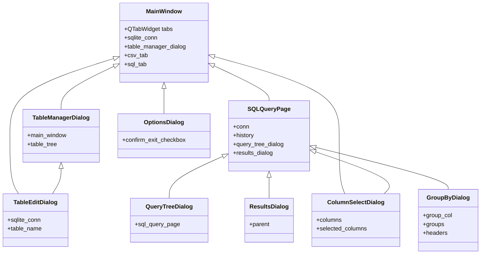

Вот дерево связей основных классов вашего проекта (csvQuery):

**Пояснения:**
- `MainWindow` — главное окно приложения, содержит вкладки, менеджер таблиц, соединение с БД и т.д.
- `TableManagerDialog` — диалог управления таблицами, вызывается из `MainWindow`.
- `TableEditDialog` — диалог редактирования таблицы, вызывается из `TableManagerDialog` и использует соединение с БД.
- `SQLQueryPage` — страница для работы с SQL-запросами, одна из вкладок в `MainWindow`.
- `QueryTreeDialog` и `ResultsDialog` — вспомогательные диалоги для работы с историей запросов и результатами, используются в `SQLQueryPage`.
- `ColumnSelectDialog` — диалог выбора столбцов, используется в разных местах.
- `GroupByDialog` — диалог группировки данных, вызывается из SQL-запросов.
- `OptionsDialog` — диалог настроек, вызывается из `MainWindow`. 