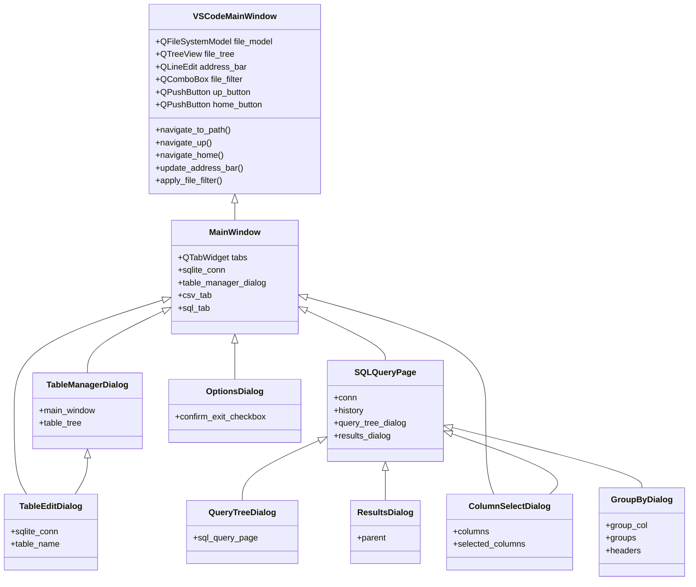

Вот дерево связей основных классов вашего проекта (csvQuery):

**Пояснения:**
- `VSCodeMainWindow` — расширенное главное окно с файловым проводником, наследует от `MainWindow` и добавляет:
  - Файловый проводник с деревом файлов (`QFileSystemModel` + `QTreeView`)
  - Адресную строку для навигации по директориям (`QLineEdit`)
  - Фильтрацию файлов по типу (`QComboBox`)
  - Кнопки навигации "Вверх" и "Домой" (`QPushButton`)
  - Методы для навигации и обновления интерфейса
- `MainWindow` — базовое главное окно приложения, содержит вкладки, менеджер таблиц, соединение с БД и т.д.
- `TableManagerDialog` — диалог управления таблицами, вызывается из `MainWindow`.
- `TableEditDialog` — диалог редактирования таблицы, вызывается из `TableManagerDialog` и использует соединение с БД.
- `SQLQueryPage` — страница для работы с SQL-запросами, одна из вкладок в `MainWindow`.
- `QueryTreeDialog` и `ResultsDialog` — вспомогательные диалоги для работы с историей запросов и результатами, используются в `SQLQueryPage`.
- `ColumnSelectDialog` — диалог выбора столбцов, используется в разных местах.
- `GroupByDialog` — диалог группировки данных, вызывается из SQL-запросов.
- `OptionsDialog` — диалог настроек, вызывается из `MainWindow`.